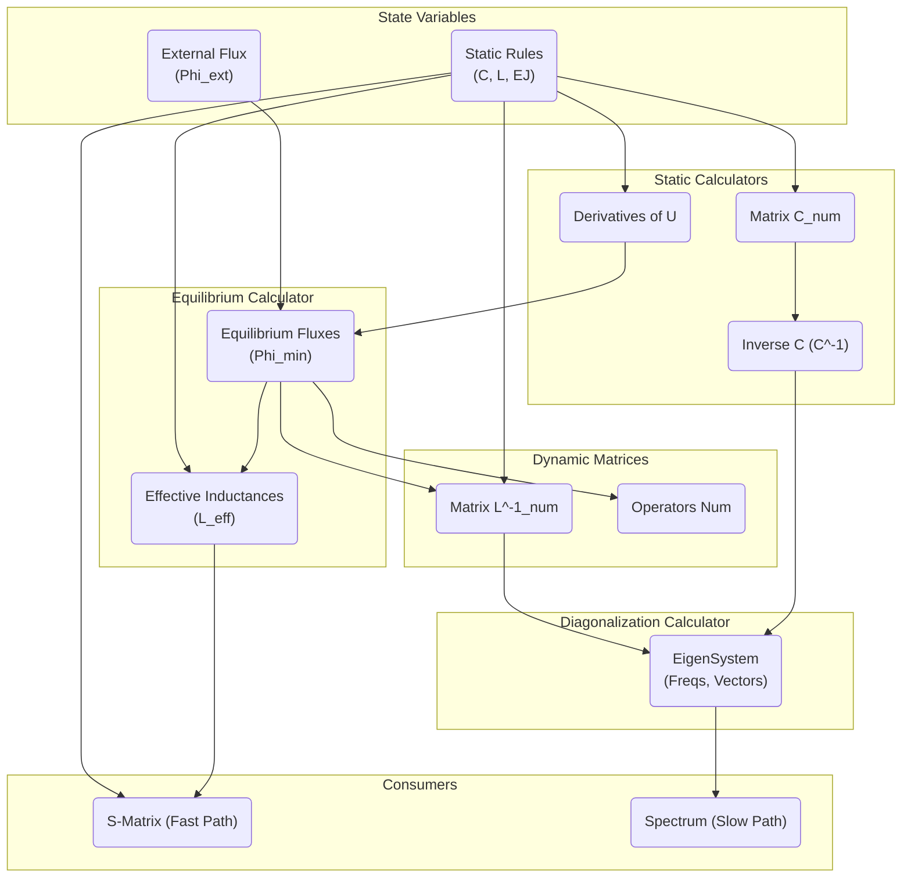
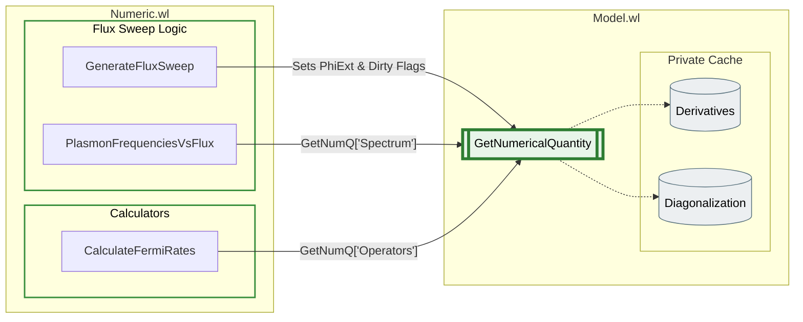
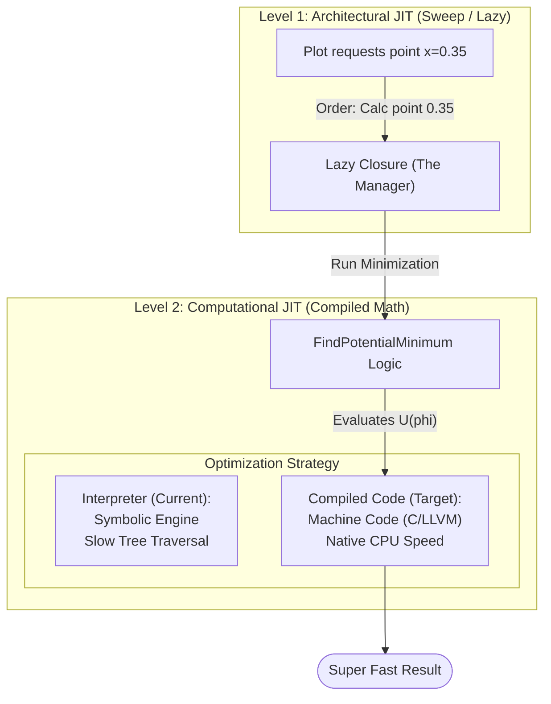

# Master Plan: QED Architecture Refactoring (Lazy Evaluation & JIT)

Этот документ описывает дорожную карту перехода архитектуры пакета `qed` от монолитных вычислений к оптимизированному графу зависимостей.

**Главные цели:**
1.  **Производительность:** Внедрение JIT-компиляции (Procedural C-Style) для поиска классического минимума (ускорение 20-50x).
2.  **Ленивость:** Исключение тяжелых квантовых расчетов (диагонализации) при свипах S-матрицы.
3.  **Стабильность:** Устранение утечек памяти в замыканиях и безопасное управление кэшем.

---

## Фаза 0: Подготовка Данных (Data Marshalling)

**Цель:** Подготовить инфраструктуру для быстрой передачи параметров в скомпилированные функции, минуя медленные правила замен (`Rules`).

- [x] **0.1. Канонизация Параметров**
    - Реализовать жесткую сортировку параметров модели (алфавитную).
    - Создать функцию `GetParameterVector[model]` $\to$ `List of Reals` (Packed Array).
    - *Обоснование:* Скомпилированные функции (`Compile`) требуют плоский вектор чисел на входе. Глобальные переменные или `Rules` убивают производительность.

---

## Фаза 1: Декомпозиция (Calculators.wl)

**Цель:** Выделить чистую логику вычислений в атомарные функции.

**Новый файл:** `src/Numeric/Calculators.wl`

- [x] **1.1. Статический блок (JIT Core)**
    - `CalcCompiledEngines[analytical]` $\to$ `{FastGrad, FastHess}`.
        - *Техника:* Процедурная компиляция (`Do` loops внутри `Compile`). Избегать `Evaluate` сложных выражений.
        - *Вход:* Вектор координат $\vec{\phi}$ + Вектор параметров $\vec{p}$.
        - *Выход:* Градиент (вектор) и Гессиан (матрица) как `CompiledFunction` (Target: C).
    - `CalcStaticMatrices[analytical, params]` $\to$ `{C_num, InvC_num}`.
        - *Оптимизация:* Обращение матрицы емкости ($C^{-1}$) выполняется здесь один раз.

- [ ] **1.2. Классический блок (Equilibrium Calculator)**
    - `CalcEquilibrium[compiledEngines, phiExt, guess, paramVector]` $\to$ `{PhiMin, EffInd}`.
        - *Логика:* Вызывает `FindRoot` с явным указанием `Jacobian -> FastHess`.
        - *Результат:* Мгновенная сходимость метода Ньютона.

- [ ] **1.3. Динамический блок (Dynamic Calculators)**
    - `CalcSystemMatrices[analytical, phiMin]` $\to$ `{LInv_num, Operators_num}`.
        - *Укрупнение:* Считаем матрицы и операторы вместе.
    - `CalcEigenSystem[InvC, LInv]` $\to$ `{Frequencies, EigenVectors}`.
        - *Важно:* Самая тяжелая функция. Вызывается **строго** по запросу (Lazy).

- [ ] **1.4. Блок Рассеяния (Numeric Scattering)**
    - *Проблема:* Текущий `Scattering.wl` работает символьно.
    - *Решение:* Реализовать `CalcSMatrixNumeric[InvC, EffInd, Freqs]`.
    - *Логика:* Принимать численные матрицы (Packed Arrays) и решать `LinearSolve` напрямую.

---

## Фаза 2: Движок Зависимостей (Model.wl)

**Цель:** Научить `Model.wl` управлять состоянием кэша.

- [ ] **2.1. Реестр Зависимостей**
    - Описать граф связей (например, `"Spectrum"` $\to$ `"SystemMatrices"`).

- [ ] **2.2. Умный `GetNumericalQuantity`**
    - Реализовать рекурсивный опрос: `Check Cache -> If Missing -> Call Calculator -> Set Cache`.

- [ ] **2.3. Стратегия Инвалидации (Hash-based Versioning)**
    - Ключ кэша = `Hash[{PhiExt, ParameterVector}]`.
    - *Плюс:* Автоматически решает проблему "грязного кэша" и позволяет реализовать мгновенный Undo/Redo в GUI.

---

### Стратегии организации кэша для Свипа (задел на Фазу 3/4)

Для реализации "Умного предсказания" (Smart Predict) начальной точки в методе Continuation мы используем кэширование истории вычислений `{PhiExt -> PhiMin}`. 

* **Встроенный `Nearest`:** В Wolfram Language есть супероптимизированная функция `Nearest[keys -> values]`, которая под капотом строит KD-дерево.
    * **Плюс:** Поиск ближайшего соседа (стартовой точки для метода Ньютона) занимает наносекунды. Это идеально ложится на адаптивный алгоритм шагов встроенного `Plot`.
    * **Минус:** При добавлении каждой новой вычисленной точки KD-дерево нужно перестраивать заново. 
    * **Вердикт:** Для типичного графика, где количество точек $N < 1000$, суммарная перестройка дерева занимает микросекунды. Сложность алгоритма не станет узким местом системы, так как основное время всё равно уходит на JIT-вычисления в `FindRoot`. Это самый надежный и чистый "коробочный" подход.

---

## Фаза 3: Рефакторинг Потребителей (Numeric.wl)

**Цель:** Перевести Sweep на ленивые рельсы.

- [ ] **3.1. Фабрика Sweep (`GenerateFluxSweep`)**
    - **Stripped Closure:** Перед созданием замыкания создавать "Скелет Модели" (`Lightweight Model`) — копию без тяжелых данных.
    - **Lazy Execution:** Внутри замыкания обновлять `PhiExt` и вызывать `analysisFunc`.

- [ ] **3.2. Очистка API**
    - Перевести все внешние функции на использование `GetNumericalQuantity`.

---

## Фаза 4: Оптимизация Классики (Smart Pathing)

**Цель:** Ускорение свипов за счет предсказания начальной точки.

- [ ] **4.1. Smart Path Caching**
    - Внутри замыкания свипа хранить локальную историю `{PhiExt -> PhiMin}`.
    - Использовать результат ближайшего соседа как `InitialGuess` для `FindRoot`.
## Фаза 5: Версионность и GUI (Advanced)

**Цель:** Мгновенный отклик GUI при возврате слайдера назад.

- [ ] **5.1. Хеширование Состояния**
    - Реализовать функцию `GetStateHash[model]`, зависящую от `Primary` параметров.
    - Превратить кэш модели в `VersionedCache[hash] -> Results`.

- [ ] **5.2. Интеграция в `Interactive.wl`**
    - При движении слайдера `GetNumericalQuantity` проверяет, было ли такое состояние (hash) вычислено ранее, прежде чем запускать пересчет.

---

# Справочные материалы (Архитектурные Графы)

## 1. Граф Вычислительной Логики (Runtime Logic)
*Показывает поток данных: какие величины нужны для вычисления других. Основа для `Calculators.wl`.*

## 2. Граф Доступа к Данным (Target Architecture)
*Показывает целевое состояние: все функции `Numeric.wl` используют только публичный API.*

## 3. Граф Оптимизации Sweep (Functional JIT Architecture)
*Этот граф показывает структуру Чистой Функции, которую возвращает `GenerateFluxSweep`.*
* **Серый блок (Captured Context)**: Данные, которые вычисляются 1 раз и "живут" внутри замыкания.
* **Зеленый блок (Execution Flow)**: То, что происходит при каждом вызове функции (например, внутри `Plot`).

## 4. Граф дуальной JIT ахитектуры 

