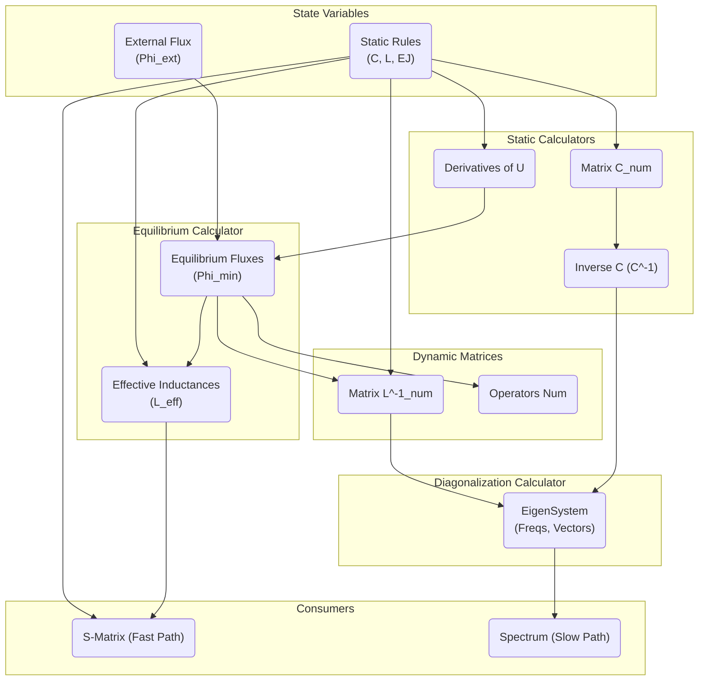
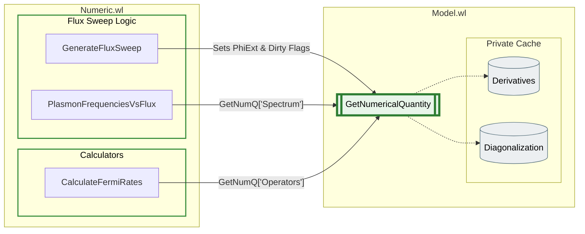
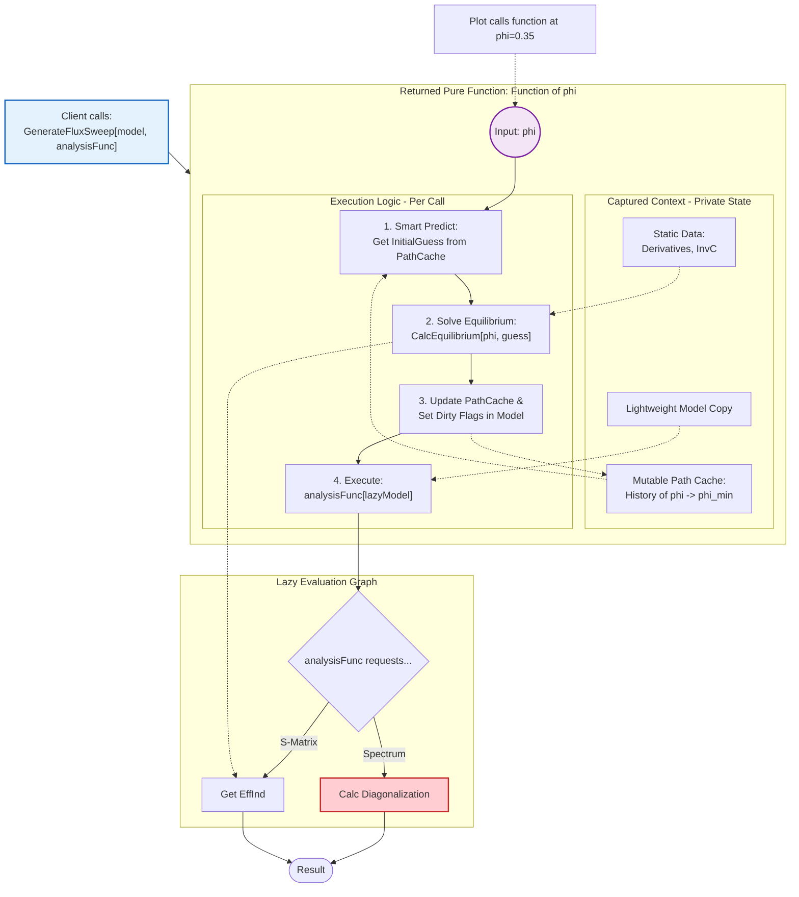

# Master Plan: QED Architecture Refactoring (Lazy Evaluation & Optimization)

Этот документ описывает дорожную карту перехода от монолитной архитектуры вычислений к графу зависимостей (Dependency Graph) с ленивыми вычислениями (Lazy Evaluation).

**Главные цели:**
1.  **Ускорение `FluxSweep` и `Plot`:** Исключить вычисление диагонализации там, где она не нужна (например, при расчете S-Matrix или классических токов).
2.  **JIT-совместимость:** Обеспечить мгновенный расчет произвольных точек рабочей точки для адаптивного сэмплирования в функции `Plot`.
3.  **Инкапсуляция:** Убрать прямой доступ функций `Numeric.wl` к внутренним структурам кэша `Model.wl`.

---

## Фаза 1: Декомпозиция (Создание `Calculators.wl`)

**Цель:** Выделить чистую логику вычислений из монолита `ComputeNumericalHarmonicPerturbation` в атомарные функции без побочных эффектов.

**Новый файл:** `src/Numeric/Calculators.wl`

- [ ] **1.1. Статический блок (Static Calculators)**
    - `CalcCompiledPotential[analytical]` $\to$ `CompiledFunction`.
        - *JIT Optimization:* Компилирует символьное выражение потенциала $U(\vec{\phi}, \Phi_{ext})$ в машинный код (C/LLVM).
        - *Цель:* Ускорение `FindRoot` в 10–100 раз за счет отказа от интерпретатора при вычислении $U$ и $\nabla U$.
    - `CalcDerivatives[analytical, params]` $\to$ `{Gradient, Hessian}`.
        - *Особенность:* Символьные производные, кэшируются "навечно".
    - `CalcStaticMatrices[analytical, params]` $\to$ `{C_num, InvC_num}`.
        - *Оптимизация:* Обращение матрицы емкости выносится сюда.

- [ ] **1.2. Классический блок (Equilibrium Calculator)**
    - `CalcEquilibrium[derivatives, phiExt, initialGuess]` $\to$ `{PhiMin, EffInd}`.
        - *Логика:* Обертка над `FindPotentialMinimumContinuation`. Должна принимать "подсказку" (`initialGuess`) из кэша для ускорения поиска.

- [ ] **1.3. Динамический блок (Dynamic Calculators)**
    - `CalcDynamicMatrices[analytical, phiMin]` $\to$ `{LInv_num, Operators_num}`.
    - `CalcDiagonalization[InvC, LInv]` $\to$ `{Frequencies, EigenVectors}`.
        - *Важно:* Это самая ресурсоемкая функция. Она должна вызываться **только** если запрошен Спектр, $T_1$ или Волновая функция.

- [ ] **1.4. Блок Рассеяния (Scattering Calculator)**
    - `CalcSMatrix[symS, effInd, freqs]` $\to$ `SMatrix`.
        - *Важно:* Реализовать "Быстрый путь" (Fast Path), использующий только `effInd`, минуя диагонализацию.

---

## Фаза 2: Движок Зависимостей (Refactoring `Model.wl`)

**Цель:** Научить `Model.wl` управлять состоянием кэша и вызывать калькуляторы по требованию.

- [ ] **2.1. Реестр Зависимостей (Dependency Registry)**
    - Создать структуру (`Association`), описывающую граф зависимостей.
    - Пример: `"SMatrix" -> {"EffectiveInductances", "StaticRules"}`.

- [ ] **2.2. Умный `GetNumericalQuantity`**
    - Переписать функцию так, чтобы она рекурсивно проверяла валидность ключей.
    - Логика: `Если (Cache[key] === Missing) -> Вызвать Calculator -> Записать в Cache`.

- [ ] **2.3. Механизм инвалидации (Dirty Flags)**
    - Вместо глобального флага `IsDirty`, внедрить точечный сброс.
    - При изменении `PhiExt` сбрасываем: `PhiMin`, `EffInd`, `LInv`, `Diag`, `SMatrix`.
    - Оставляем нетронутыми: `DerivCache`, `InvC`.

---

## Фаза 3: Рефакторинг Потребителей (`Numeric.wl`)

**Цель:** Убрать "Красную зону" (прямой доступ к кэшу) и перевести Sweep на ленивые рельсы.

- [ ] **3.1. Переписывание `GenerateFluxSweep`**
    - Убрать вызов `UpdateModelWithRules` внутри замыкания.
    - **Новая логика замыкания:**
        1. Создать копию модели (Lightweight Model).
        2. Обновить в ней значение `PhiExt`.
        3. Сбросить флаги зависимых узлов (`PhiMin` и ниже).
        4. Передать эту "ленивую" модель в `analysisFunc`.
    - **Результат:** `Plot[sweepFunc[x]]` сам вызывает `GetNumericalQuantity`, который сам решает, нужно ли считать диагонализацию.

- [ ] **3.2. Очистка `PlasmonFrequenciesVsFlux`**
    - Полностью перевести на использование API `GetNumericalQuantity`.

---

## Фаза 4: Оптимизация Классики (`FindPotentialMinimum`)

**Цель:** Сделать поиск рабочей точки мгновенным для `Plot` (Random Access).

- [ ] **4.1. Внедрение Smart Path Caching**
    - Внутри замыкания `GenerateFluxSweep` создать локальный кэш `{PhiExt -> PhiMin}`.
    - При запросе точки $\Phi_{target}$:
        1. Искать ближайшую точку $\Phi_{prev}$ в истории.
        2. Использовать $\phi_{min}(\Phi_{prev})$ как стартовое приближение для метода Ньютона.

- [ ] **4.2. Предиктор (Implicit Function Theorem) — *Альтернативная стратегия***
    - Реализовать вычисление $d\phi_{min}/d\Phi_{ext}$ через обратный Гессиан.
    - Использовать линейную экстраполяцию для старта поиска: $\phi_{guess} \approx \phi_{prev} + \phi' \cdot \Delta \Phi$.

---

## Фаза 5: Версионность и GUI (Advanced)

**Цель:** Мгновенный отклик GUI при возврате слайдера назад.

- [ ] **5.1. Хеширование Состояния**
    - Реализовать функцию `GetStateHash[model]`, зависящую от `Primary` параметров.
    - Превратить кэш модели в `VersionedCache[hash] -> Results`.

- [ ] **5.2. Интеграция в `Interactive.wl`**
    - При движении слайдера `GetNumericalQuantity` проверяет, было ли такое состояние (hash) вычислено ранее, прежде чем запускать пересчет.

---

# Справочные материалы (Архитектурные Графы)

## 1. Граф Вычислительной Логики (Runtime Logic)
*Показывает поток данных: какие величины нужны для вычисления других. Основа для `Calculators.wl`.*

## 2. Граф Доступа к Данным (Target Architecture)
*Показывает целевое состояние: все функции `Numeric.wl` используют только публичный API.*

## 3. Граф Оптимизации Sweep (Functional JIT Architecture)
*Этот граф показывает структуру Чистой Функции, которую возвращает `GenerateFluxSweep`.*
* **Серый блок (Captured Context)**: Данные, которые вычисляются 1 раз и "живут" внутри замыкания.
* **Зеленый блок (Execution Flow)**: То, что происходит при каждом вызове функции (например, внутри `Plot`).

## 4. Граф дуальной JIT ахитектуры 

